# RDTX VisualLab

**RDTX VisualLab: Web-Based Reliable File Transfer and Selective Repeat Analysis over Unreliable UDP**

RDTX VisualLab is a local-first Computer Networks experimentation application built around a **real reliable file-transfer protocol over UDP**. The browser is the control and observability layer; the transport itself remains Python UDP sockets implementing Selective Repeat ARQ.

### See it in 45 seconds

*Illustrated explainer, not a recorded transfer or measured benchmark.* [View the 45-second recording plan and reproducible local demo ↗](docs/SHORT_DEMO.md). The real app is local-first; launch it with `rdtx-web` after setup.

## Why this project exists

UDP does not provide reliable delivery, ordering, duplicate suppression, retransmission, or connection-oriented state. RDTX makes those mechanisms explicit and observable.

The project combines:

- strict Selective Repeat sender-window behavior;
- individual ACKs and per-packet retransmission timers;
- CRC32 datagram validation;
- out-of-order buffering and duplicate handling;
- SHA-256 final-file verification;
- configurable DATA/ACK loss, corruption, delay, and DATA reordering;
- live browser telemetry driven by actual protocol events;
- localhost and two-host LAN experiments;
- repeatable parameter sweeps and report generation.

The research claim is **integration and observability**, not invention of a new ARQ algorithm. See [Research Gap](docs/RESEARCH_GAP.md).

## Architecture

~~~text
                           HTTP + SSE
Browser  <-------------------------------------->  Flask VisualLab
                                                        |
                                                        | launches / observes
                                                        v
File ---> RDTX Sender ======== real UDP ========> RDTX Receiver ---> File
          Selective Repeat                        buffer + ACK
          seq / timeout                           CRC32
          retransmission                          duplicate handling
                  |                                  |
                  +------ loss / delay / corruption-+
                                                     |
                                                  SHA-256
                                                     |
                                                  FIN_ACK
~~~

In **LAN mode**, sender and receiver can run on different laptops on the same network.

## Quick start on macOS

~~~bash
git clone https://github.com/krutharth-dev/RDTX-Reliable-UDP-Transfer.git
cd RDTX-Reliable-UDP-Transfer

python3 -m venv .venv
source .venv/bin/activate
python3 -m pip install -e .

rdtx --version
make test
rdtx-web
~~~

Open:

~~~text
http://127.0.0.1:5000
~~~

Expected version:

~~~text
RDTX 2.2.1
~~~

## Recommended demo flow

### 1. Baseline

Upload `demo.txt`, choose **Baseline**, and show normal window progression with integrity PASS.

### 2. Loss recovery

Use:

~~~text
DATA loss: 20%
ACK loss: 10%
Window: 8
Seed: 2026
~~~

Filter the timeline to **Drop** and **Retry**.

### 3. Reordering

Use 100% reordering and show that arrival/transmit order can differ while sequence numbers still allow correct reconstruction.

### 4. Two-host LAN

On Laptop B:

~~~bash
rdtx receive --host 0.0.0.0 --port 9000 --output-dir received --trace
~~~

On Laptop A select **LAN / two-host**, enter Laptop B's LAN IP, and send the file.

### 5. Matrix Lab

Sweep:

~~~text
Window size: 1,4,8,16
~~~

or:

~~~text
DATA loss: 0,10,20,30
~~~

Download the matrix report and compare measured throughput/retransmissions.

## Evidence generated by the project

A completed experiment can provide:

- reconstructed file download for local runs;
- JSON run export;
- Markdown experiment report;
- CSV experiment-history export;
- Markdown matrix comparison report;
- benchmark CSV and Markdown outputs.

These artifacts are intended to support the report with **measured results from the actual demo machine**, not fabricated values.

## CLI

The web app is optional. The protocol remains usable directly:

~~~bash
rdtx send demo.txt --host 127.0.0.1 --loss 0.20 --trace
rdtx receive --host 0.0.0.0 --port 9000 --trace
rdtx benchmark
~~~

## Verification

Run the normal suite:

~~~bash
make test
~~~

Run tests plus the standard benchmark:

~~~bash
make verify
~~~

Before evaluation day, run the dedicated readiness check:

~~~bash
make demo-check
~~~

GitHub Actions verifies Python 3.10, 3.11, 3.12, and 3.13. The Python 3.12 job also performs a real UDP benchmark smoke test and retains its CSV/Markdown outputs as CI artifacts.

## Documentation

| Document | Purpose |
|---|---|
| [Mini-project report](docs/MINI_PROJECT_REPORT.md) | Submission-ready technical narrative |
| [Research gap](docs/RESEARCH_GAP.md) | Defensible project positioning |
| [Protocol](docs/PROTOCOL.md) | Packet format and transfer behavior |
| [Algorithms](docs/ALGORITHMS.md) | Selective Repeat pseudocode |
| [Architecture](docs/ARCHITECTURE.md) | Core protocol architecture |
| [Web architecture](docs/WEB_ARCHITECTURE.md) | Browser/backend/UDP separation |
| [LAN mode](docs/LAN_MODE.md) | Two-laptop setup |
| [Matrix experiments](docs/MATRIX_EXPERIMENTS.md) | Controlled parameter sweeps |
| [Reproducibility](docs/REPRODUCIBILITY.md) | Experimental methodology |
| [Testing](docs/TESTING.md) | Verification strategy |
| [Demo guide](docs/DEMO_GUIDE.md) | Evaluation sequence |
| [45-second showcase](docs/SHORT_DEMO.md) | Illustrated preview, recording shot list, and local reproduction instructions |
| [Troubleshooting](docs/TROUBLESHOOTING.md) | Fast recovery from demo problems |
| [Viva guide](docs/VIVA_GUIDE.md) | Key technical questions |
| [Submission checklist](docs/SUBMISSION_CHECKLIST.md) | Final pre-submission checks |

## Scope

RDTX VisualLab is an educational protocol laboratory, not a TCP/QUIC replacement and not an internet-facing production file-sharing service. It uses a fixed retransmission timeout, IPv4, full-file buffering, and no congestion control, authentication, or encryption.

The web server binds to localhost by default. See [SECURITY.md](SECURITY.md) before changing bind addresses.

## License

MIT — see [LICENSE](LICENSE).
